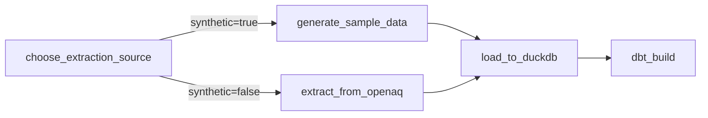

# Orquestração do Pipeline de Qualidade do Ar com Airflow

Coloca o pipeline construído no
[Projeto 01](https://github.com/amanda-martins-data/pipeline-qualidade-ar)
(extract → load → dbt build) sob orquestração de produção com Apache
Airflow: agendamento, retries com backoff, e uma branch que permite
rodar com dados reais ou sintéticos sem tocar em código.

Projeto 02 de uma série de 6 documentando minha transição de Analista
de Dados para Engenharia/Arquitetura de Dados — veja o [perfil
completo](https://github.com/amanda-martins-data).

## Arquitetura



Decisões de arquitetura e trade-offs documentados em
[`docs/architecture.md`](docs/architecture.md).

## Stack

`Apache Airflow` · `Docker Compose` · `Python` · `dbt` · `DuckDB` · `Postgres`

## Estrutura

```
.
├── dags/
│   └── air_quality_pipeline_dag.py   # a DAG
├── include/
│   ├── src/                          # extract.py, load.py, generate_sample_data.py (do Projeto 01)
│   └── dbt_project/                  # projeto dbt (do Projeto 01)
├── docs/architecture.md              # decisões e trade-offs
├── Dockerfile                        # imagem do Airflow + dependências do pipeline
├── docker-compose.yaml               # Postgres + webserver + scheduler (LocalExecutor)
└── requirements.txt                  # deps Python usadas dentro dos containers
```

## Como rodar

```bash
docker compose up airflow-init   # cria o banco e o usuário admin (airflow / airflow)
docker compose up                # sobe webserver + scheduler
```

Acesse **http://localhost:8080**, ative a DAG `air_quality_pipeline` e
dispare uma execução manual — ela roda com dados sintéticos por padrão
(`AIRFLOW_VAR_AIR_QUALITY_USE_SYNTHETIC=true` no `docker-compose.yaml`),
sem precisar de nenhuma credencial externa.

Para usar dados reais da OpenAQ, defina a Variable
`air_quality_use_synthetic=false` na UI do Airflow e configure a
variável de ambiente `OPENAQ_API_KEY` no container (key gratuita em
https://explore.openaq.org/register).

## Validação

A DAG foi testada de ponta a ponta com `airflow dags test` antes da
publicação: as 4 tasks completam com sucesso, incluindo os 11 testes de
dados do dbt herdados do Projeto 01.

## Próximos passos do portfólio

- **Projeto 03** — evoluir para arquitetura Medallion (bronze/silver/gold).
- **Projeto 06** — observabilidade e testes de qualidade mais robustos.
