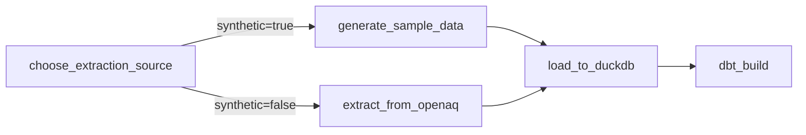

# Arquitetura — Orquestração com Airflow

## Visão geral

Esta DAG orquestra o mesmo pipeline construído no
[Projeto 01](https://github.com/amanda-martins-data/pipeline-qualidade-ar)
— os scripts `extract.py`, `generate_sample_data.py`, `load.py` e o
projeto dbt foram reaproveitados sem alterações, em `include/`.

## Decisões e trade-offs

### 1. TaskFlow API + BashOperator (não uma DAG 100% "clássica")
As etapas em Python usam `@task` (TaskFlow API), mais legível e com
passagem de dados implícita via XCom quando necessário. O `dbt build`
usa `BashOperator` deliberadamente — não existe motivo para "pythonizar"
uma chamada de CLI; usar o Airflow para invocar a ferramenta certa da
forma mais direta é a decisão mais simples e mais fácil de depurar.

### 2. Branch entre dado real e sintético via Airflow Variable
`choose_extraction_source` decide entre `extract_from_openaq` (API real,
precisa de key) e `generate_sample_data` (fixture) lendo a Variable
`air_quality_use_synthetic`. Isso significa que **qualquer pessoa pode
subir esta DAG e vê-la rodar com sucesso imediatamente**, sem precisar
de credenciais — e trocar para dados reais em produção é uma mudança de
configuração, não de código.

### 3. Retries com backoff exponencial
`retries=3`, `retry_delay=5min`, `retry_exponential_backoff=True`.
Falhas de rede contra a API da OpenAQ são tipicamente transitórias;
falhar rápido e desistir seria pior do que uma DAG que se recupera
sozinha de instabilidades pontuais.

### 4. `trigger_rule="none_failed_min_one_success"` no load
Como só uma das duas branches (`extract_from_openaq` ou
`generate_sample_data`) de fato roda — a outra fica `skipped` pelo
`BranchPythonOperator` — o `load_to_duckdb` precisa de uma trigger rule
que aceite "pelo menos uma das branches teve sucesso", em vez da regra
padrão (`all_success`), que bloquearia a DAG inteira.

### 5. `schedule="@daily"`, `catchup=False`
Cada execução processa a janela do dia corrente. `catchup=False` evita
que a primeira ativação da DAG dispare dezenas de execuções retroativas
de uma vez — comportamento adequado para um pipeline de métricas
correntes, não para uma carga histórica única.

### 6. Docker Compose com LocalExecutor (sem Celery/Redis)
Para uma única DAG em ambiente de portfólio/dev, `LocalExecutor` com
Postgres já dá paralelismo real entre tasks sem a complexidade
operacional de um cluster Celery. Trocar para `CeleryExecutor` seria
uma decisão de escala, não de correção.

## Validação

A DAG foi validada localmente com `airflow dags test`, sem Docker,
antes de ser publicada — execução completa das 4 tasks com
`state=success`, incluindo os 11 testes de dados do dbt (herdados do
Projeto 01) passando dentro da orquestração.

## Limitações conhecidas / próximos passos
- Sem alertas configurados (`on_failure_callback`) — ponto natural de
  evolução ao integrar com Slack/e-mail.
- Sem `SLA` definido nas tasks.
- A arquitetura de camadas (bronze/silver/gold) ainda é simples — é o
  escopo do **Projeto 03**.
